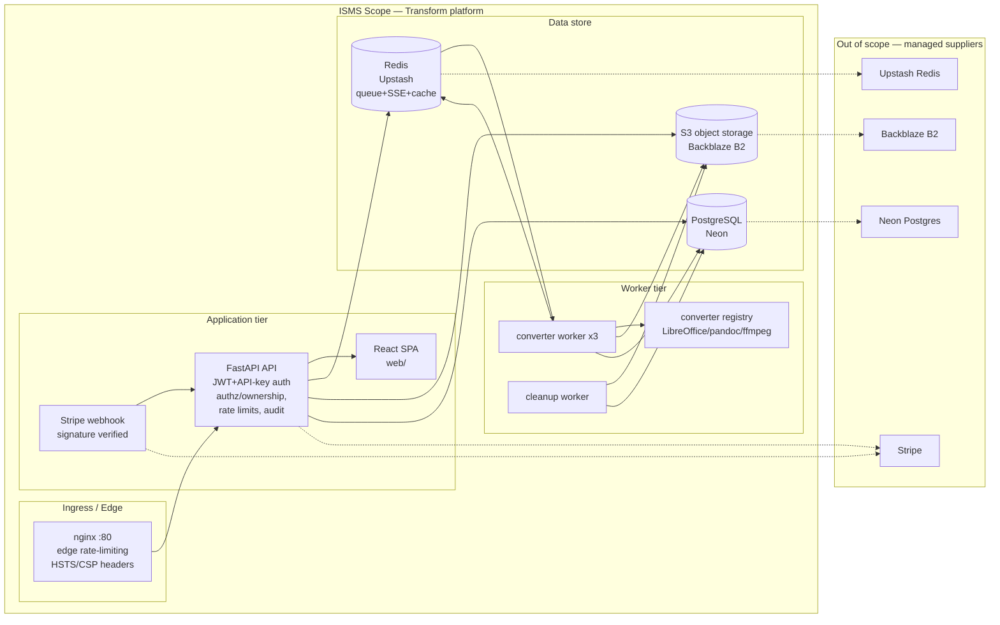

# ISMS Overview — Transform (File Conversion SaaS)

_ISO 27001:2022 Information Security Management System — Stage 1/2 audit pack_
**Document owner:** CISO / InfoSec Lead
**Classification:** Internal — Confidential
**Last updated:** 2026-08-22

---

## 1. Purpose

This document describes the Transform Information Security Management System
(ISMS) at a glance: what is in scope, how ISO/IEC 27001:2022 Annex A controls
are applied, who owns the ISMS, and the internal/external context that shapes
our security posture. It is the entry point for the auditor — every other
document in `docs/security/` expands on a section referenced here.

---

## 2. The organisation

**Transform** is a file-conversion Software-as-a-Service (SaaS) platform. The
product converts documents, spreadsheets, presentations, images, audio, video,
ebooks and archives between formats, with real-time progress, subscription
billing and secure storage.

**Core architecture (as deployed):**

| Layer | Technology | Evidence |
|---|---|---|
| API | FastAPI, Python 3.14 (async), Uvicorn | `src/presentation/api/main.py`, `pyproject.toml` |
| Data | PostgreSQL via SQLAlchemy 2.0 (async) + Alembic migrations | `src/infrastructure/database/`, `alembic.ini` |
| Queue & events | Redis Streams (job queue + SSE status) | `src/infrastructure/adapters/queues/` |
| Object storage | S3-compatible (Minio local / Backblaze B2 prod) | `src/infrastructure/adapters/storage/` |
| Auth | JWT (access + refresh) + hashed API keys; argon2 passwords | `src/infrastructure/auth/jwt_provider.py` |
| Billing | Stripe payments + signature-verified webhooks | `src/presentation/api/routers/v1/webhooks.py` |
| Monitoring | Prometheus `/metrics`, health/readiness probes | `src/presentation/api/main.py` |
| Runtime | Docker Compose (api, worker ×3, worker-cleanup, postgres, redis, minio, nginx) | `deployment/docker/compose.yaml` |
| Worker | Conversion orchestration, at-rest encryption, credit enforcement | `workers/converter_workers/processor.py` |

**Clean architecture** — the codebase is split into `domain/` (business rules),
`application/` (use cases + ports), `infrastructure/` (adapters), and
`presentation/` (HTTP boundary), with an independent `workers/` package. This
separation is itself an ISO A.8.31 (separation of environments) & A.8.25 (secure
development lifecycle) enabler — business logic is decoupled from transport and
storage, which makes the security boundary auditable.

---

## 3. Scope of the ISMS

### 3.1 In scope (statement of applicability)

The Transform SaaS **platform** — the services we own, operate, and control:

- **API / presentation tier** — FastAPI application, JWT + API-key authentication,
  tier-based authorization, rate limiting, security headers, uploads/downloads,
  conversion orchestration endpoints, SSE events, Stripe webhooks.
- **Web application** — the React SPA served by the API (`web/`), including auth
  flows, file browser, job status, billing portal.
- **Worker pipeline** — converter workers (×3), cleanup worker, converter
  registry/functions (LibreOffice, pandoc, ffmpeg, calibre, Pillow, cairosvg,
  fonttools).
- **Data stores we manage** — application PostgreSQL schema, Redis streams/session
  caches, S3-compatible bucket (upload temp, output objects), object-key naming.
- **Cryptographic controls** — at-rest AES-256-GCM file encryption, per-user key
  derivation, key rotation, JWT signing, hashed API keys, password hashing.
- **Configuration & secrets handling** — `.env`, settings validation, boot-time
  production safeguards.
- **Supporting security controls** — audit logging, rate limiting, ownership
  checks, path-traversal sanitization.

### 3.2 Out of scope (explicit exclusions)

- **Customer-managed infrastructure** — client networks, devices, on-prem systems,
  and any transformation the customer applies to produced files.
- **Third-party SaaS beyond the listed providers** — Stripe, Neon (Postgres),
  Upstash (Redis), Backblaze B2 (object storage). Their physical, personnel and
  platform security is governed by their respective SOC 2 / ISO 27001
  attestations and our supplier agreements (see `A.5.19–A.5.23` in
  `statement-of-applicability.md`).
- **The customers' content** — we process it transiently; we do not govern how
  the customer classifies, stores, or shares it. We do govern our retention
  and deletion of it (see `backup-recovery.md` and `security-policy.md`).
- **Physical data centres / office premises** — the platform is multi-tenant
  SaaS (no owned physical facility); physical security is delegated to the
  cloud/colocation provider and treated as an inherited control (`A.7.x`).

---

## 4. Statement of Applicability — preamble

The Statement of Applicability (`statement-of-applicability.md`) is the core
audit artifact. It applies every ISO/IEC 27001:2022 Annex A control across the
four themes — **A.5 Organizational**, **A.6 People**, **A.7 Physical**,
**A.8 Technological** — to the in-scope services above.

Each control is assessed as one of:

| Status | Meaning |
|---|---|
| **Implemented** | Control is in place and evidenced by a named repository artifact / config / documented procedure. |
| **Partially implemented** | A meaningful subset is in place; a specific gap is stated. |
| **Not applicable** | Control does not apply to this SaaS scope, with a reason. |
| **Planned** | Recognised requirement, tracked as an action with an owner and target date. |

> **Honesty requirement:** This is an *assessment*, not a claim of full
> compliance. Where a control is absent or incomplete it is labelled so and the
> specific gap is named in the "Evidence / Gap" column. A control is never
> marked **Implemented** unless a concrete, verifiable artifact exists.

The controls are selected because gaps in them would materially affect the
confidentiality, integrity or availability of customer files, credentials, or the
billing plane.

---

## 5. ISMS owner & roles

| Role | RACI (R = accountable, A = responsible) | Responsibility |
|---|---|---|
| **CISO / Information Security Lead** | R | Owns the ISMS, the Statement of Applicability, risk acceptance, and the annual management review. Approves exceptions & residual-risk acceptance. |
| **AppSec Engineer** | A | Implements security controls, reviews code for secure-development issues, owns the audit-log schema, key rotation, and security testing. |
| **DevOps Engineer** | A | Operates production (compose, nginx, migrations, monitoring), enforces boot-time validation, rotates secrets, owns backups/recovery runbook. |
| **Data Protection Officer (DPO)** | A | GDPR/privacy overlap: retention, data subject requests, records of processing, and supplier DPAs. |
| **Staff / Developers** | A | Applicable-use of assets, reporting security events, completing awareness training. |
| **Third-party providers (Stripe, Neon, Upstash, B2)** | A | Platform security for their respective services, per their attestations & agreements. |

**Delegated accountability** — a single InfoSec Lead is accountable for risk
acceptance; no individual accepts residual risk above the threshold in
`risk-assessment.md` without written approval.

---

## 6. Context of the organisation

### 6.1 Internal issues (SWOT-flavoured)

- **Strengths** — clean hexagonal architecture; at-rest encryption with per-user
  keys and rotation; structured audit logging; Redis-backed rate limiting;
  boot-time production validation; ownership checks across jobs/files/folders.
- **Weaknesses** — encryption is *opt-in* (plaintext when `ENCRYPTION_MASTER_KEY`
  is unset); no TLS terminator in the compose stack (HSTS on `:80` is inert);
  no malware scanning of uploads; limited automated security testing; no
  documented DR runbook in-repo.
- **Opportunities** — third-party managed services (Neon PITR, B2 versioning)
  give strong backup/RPO levers; adoption of automated SAST/DAST and a
  dependency CVE feeder is straightforward.
- **Threats** — credentials/S3-key leakage, JWT secret compromise, queue loss,
  malicious uploads (zip-bomb/AV), SQL/command injection via converters, Stripe
  webhook replay, DDoS/rate-limit bypass, master-key loss, supply-chain CVEs.

### 6.2 External issues

- **Legal/regulatory** — GDPR (EU) data protection for PII and file content;
  UK GDPR where applicable; PCI-DSS scope is avoided by delegating card
  handling to Stripe (SAQ-A).
- **Marketplace** — competitive pricing drives aggressive rate limits; customers
  demand data sovereignty, encryption-at-rest, and retention control.
- **Technology** — reliance on external tools deemed out of our control.
- **Threat landscape** — increasing credential-stuffing, ransomware, and
  supply-chain attacks against the convert-as-a-service space.

### 6.3 Interested parties & their security expectations

| Interested party | Expectation | How we address it |
|---|---|---|
| Customers (free/paid) | Confidentiality & integrity of uploaded files; availability; clear retention | At-rest encryption, ownership isolation, retention policy, status/readiness probes |
| Regulators (GDPR / TÜV Süd) | Demonstrable, proportionate control; audit evidence | This pack |
| Payment provider (Stripe) | Signature-verified webhooks, no card data at rest | `webhooks.py` verification; card handling delegated |
| Infrastructure providers | Managed-service trust, secure records | Supplier agreements & their attestations |
| Employees / contractors | Secure, defined roles; least privilege | Access-control policy |
| Investors / BOD | Risk transparency | ISMS management review, risk register |

---

## 7. ISMS scope boundary diagram

**Legend:** solid arrows are in-scope control/data flows; dashed arrows are
managed-supplier dependencies covered by supplier agreements (A.5.19–A.5.23) and
their own attestations.

---

## 8. References

| Document | Purpose |
|---|---|
| `statement-of-applicability.md` | Annex A control-by-control assessment & evidence |
| `risk-assessment.md` | Risk register, treatment plan, acceptance sign-off |
| `security-policy.md` | Top-level information security policy |
| `access-control-policy.md` | AuthN/AuthZ, token & API-key lifecycle, least privilege |
| `backup-recovery.md` | Backup, retention, RPO/RTO, DR runbook |
| `incident-response-plan.md` | Phases, severity matrix, escalation, audit-log use |
| `control-implementation-matrix.md` | ISO control → concrete repo artifact mapping |
| `README.md` | Pack index, TÜV Süd usage note, gap/action list |
