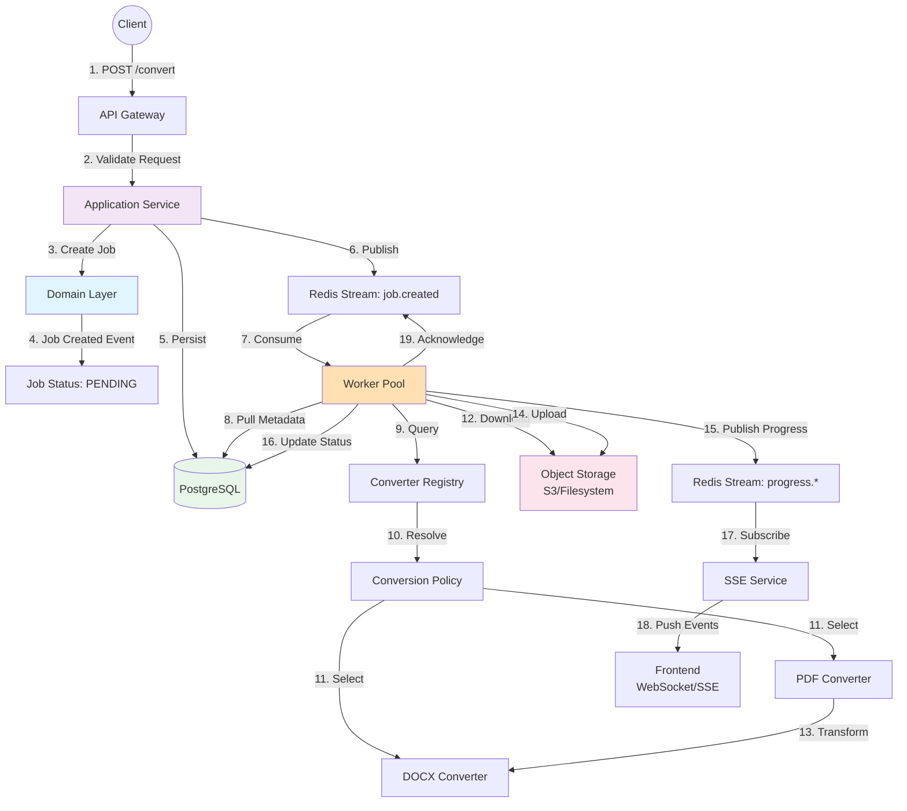
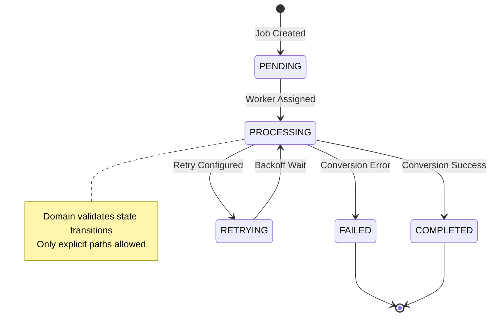
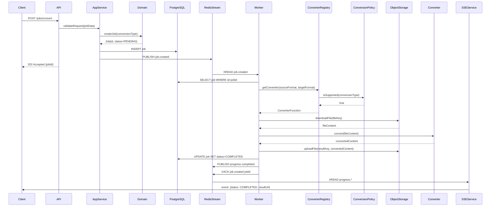
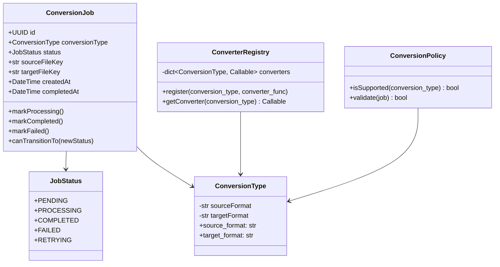

# File Converter - Detailed Architecture Plan

## Assumptions

1. **Client Role**: A frontend or external system initiates file conversion requests via HTTP API.
2. **PostgreSQL Storage**: Persistent storage for conversion jobs, metadata, and history.
3. **Redis Streams**: Used as both job queue and event publishing mechanism for scalability.
4. **Object Storage**: S3-compatible storage (or filesystem) for input/output files.
5. **SSE (Server-Sent Events)**: Real-time progress updates to connected clients.
6. **Converter Registry**: Runtime registry determines the correct converter based on file types.
7. **Worker Scalability**: Multiple workers can consume from Redis Streams independently.
8. **LibreOffice Integration**: External tool for PDF/DOCX conversions (runs as subprocess).
9. **Idempotency**: Workers should handle duplicate job processing gracefully.
10. **Error Handling**: Failed jobs are retried or sent to dead-letter queue for analysis.

---

## Mermaid Diagram

### Complete Data Flow - Flowchart



### Job State Lifecycle - State Diagram



### Request Lifecycle - Sequence Diagram



### Domain Model - Class Diagram



---

## Architecture Overview

### High-Level Pattern
- **Architecture Style**: Clean Architecture with Domain-Driven Design (DDD)
- **Concurrency Model**: Async workers consuming from event streams
- **Communication**: Event-driven (Redis Streams) + Synchronous (HTTP/PostgreSQL)
- **Resilience**: Dead-letter queues, idempotent operations, state persistence

### Key Characteristics
1. **Separation of Concerns**: Domain logic isolated from infrastructure
2. **Port & Adapter Pattern**: Storage and Queue abstracted as ports
3. **Event Sourcing Ready**: All state transitions logged to streams
4. **Scalable Workers**: Stateless workers processing from shared queue
5. **Real-time Feedback**: SSE events streamed to frontend during processing

---

## Component Responsibilities

### **API Gateway**
- **Role**: HTTP entry point for conversion requests
- **Responsibilities**:
  - Validate incoming request format and parameters
  - Authenticate/authorize client
  - Accept job submission and return 202 Accepted
  - Route health checks and monitoring requests
  - Rate limiting if needed

### **Application Service (ConversionService)**
- **Role**: Orchestrates domain logic and infrastructure coordination
- **Responsibilities**:
  - Create ConversionJob from request
  - Invoke domain service for validation
  - Persist job to PostgreSQL
  - Publish job creation event to Redis Stream
  - Retrieve job status for clients

### **Domain Layer (ConversionPolicy)**
- **Role**: Enforces business rules
- **Responsibilities**:
  - Validate conversion is supported
  - Enforce state transitions (no invalid paths)
  - Raise domain exceptions for violations
  - Provide conversion validation rules

### **Worker (Processor)**
- **Role**: Long-running converter executor
- **Responsibilities**:
  - Consume jobs from Redis Stream
  - Download input files from Object Storage
  - Query ConverterRegistry for appropriate converter
  - Invoke conversion function
  - Upload result to Object Storage
  - Publish progress events
  - Update PostgreSQL job status
  - Acknowledge/reject queue messages

### **ConverterRegistry**
- **Role**: Runtime converter lookup and invocation
- **Responsibilities**:
  - Register all available converters by ConversionType
  - Look up converter function dynamically
  - Validate converter availability before invocation
  - Handle converter versioning/fallbacks

### **Converter Functions (PDFConverter, DOCXConverter, etc.)**
- **Role**: Format-specific transformation logic
- **Responsibilities**:
  - Accept input file bytes
  - Transform to target format
  - Return converted bytes
  - Raise converter-specific exceptions
  - Optionally log conversion metrics

### **SSE Service**
- **Role**: Real-time event streaming to clients
- **Responsibilities**:
  - Subscribe to progress events from Redis Stream
  - Maintain WebSocket/SSE connections to clients
  - Filter events for specific job IDs
  - Retry failed event delivery

---

## Domain Layer Responsibilities

**Location**: `domain/`

1. **Entities** (`domain/entities/conversion_job.py`)
   - Define `ConversionJob` with immutable identity (UUID)
   - Manage state transitions via explicit methods
   - Validate state transition preconditions
   - Raise `InvalidStateTransition` exceptions on invalid transitions

2. **Value Objects** (`domain/value_object/`)
   - `ConversionType`: Immutable (source_format, target_format) pair
   - `JobStatus`: Enum of valid states (PENDING, PROCESSING, COMPLETED, FAILED, RETRYING)
   - Enforce equality by value, not reference

3. **Services** (`domain/services/conversion_policy.py`)
   - Implement `is_supported(conversion_type, supported_conversions)` rule
   - Validate business constraints (e.g., max file size, allowed formats)
   - Stateless, pure functions

4. **Exceptions** (`domain/exceptions/`)
   - `DomainError`: Base exception
   - `InvalidConversion`: Unsupported conversion type
   - `InvalidStateTransition`: Illegal job state change

---

## Application Layer Responsibilities

**Location**: `application/`

1. **Ports** (`application/ports/`)
   - `StoragePort`: Abstract download/upload operations (interface)
   - `QueuePort`: Abstract job queue operations (interface)
   - Enable dependency inversion and testability

2. **Services** (`application/services/conversion_service.py`)
   - Orchestrate use cases:
     - SubmitConversionJob: validate → create → persist → publish
     - GetJobStatus: retrieve from DB
     - CancelJob: state transition + notification
   - Coordinate domain services + infrastructure adapters
   - Transaction management (if needed)

3. **DTOs** (if separated)
   - Request/Response objects for API contracts
   - Mapping between external API format and internal models

---

## Infrastructure Layer Responsibilities

**Location**: `infrastructure/`

1. **Adapters** (`infrastructure/adapters/`)
   - **Queue** (`queue/redis_stream_queue.py`):
     - Implement `QueuePort` using Redis Streams
     - Provide `fetch_job()`, `acknowledge_job()`, `fail_job()`
     - Handle consumer groups and retry logic
   
   - **Storage** (`storage/`):
     - Implement `StoragePort` for file storage
     - Support S3-compatible APIs or filesystem
     - Handle upload/download with error retries

2. **Converters** (`infrastructure/converters/`)
   - `converter_registry.py`: Registry pattern implementation
   - `functions/pdf_docs_.py`: LibreOffice-based PDF/DOCX converters
   - `functions/audio/`: Audio format converters (future)
   - Each converter: pure function (bytes → bytes)

3. **Config** (`infrastructure/config/`)
   - `settings.py`: Load environment variables, connection strings
   - Database URL, Redis URL, S3 credentials, timeout values

4. **Logging** (`infrastructure/logging/`)
   - Centralized logger setup with structured output
   - Include worker ID, job ID, timestamps in logs

5. **Redis** (`infrastructure/redis/`)
   - Singleton client factory
   - Connection pooling and error handling

---

## Worker Layer Responsibilities

**Location**: `workers/`

1. **Main Worker Loop** (`workers/converter_workers/worker.py`)
   - Start/stop lifecycle
   - Error recovery and graceful shutdown
   - Heartbeat/health checks

2. **Processor** (`workers/converter_workers/processor.py`)
   - **Main orchestration**:
     1. Fetch job from `QueuePort`
     2. Download file from `StoragePort`
     3. Query `ConverterRegistry` for transformer
     4. Execute conversion
     5. Upload result to `StoragePort`
     6. Update job status in PostgreSQL
     7. Publish progress events to Redis Stream
     8. Acknowledge/fail job in queue

3. **Context** (`workers/converter_workers/context/worker_context.py`)
   - Hold runtime dependencies: `StoragePort`, `QueuePort`, logger
   - Provide `get_log_context()` for structured logging

4. **Port Dependencies** (`workers/converter_workers/port_dependencies.py`)
   - Define `StoragePort` and `QueuePort` protocol interfaces
   - Enable mock implementations for testing

---

## Data Flow Summary

```
1. CLIENT REQUEST PHASE:
   Client → API → AppService → Domain (validation) → PostgreSQL + Redis Stream

2. WORKER PROCESSING PHASE:
   Redis Stream → Worker → ConverterRegistry → Converter → ObjectStorage

3. PROGRESS NOTIFICATION PHASE:
   Worker → PostgreSQL (status) + Redis Stream (events)

4. FRONTEND UPDATE PHASE:
   Redis Stream → SSE Service → WebSocket → Frontend
```

---

## Potential Scaling Concerns

### 1. **Redis Stream Backpressure**
   - **Issue**: Multiple workers reading from same stream may compete
   - **Solution**: Use consumer groups with acknowledgment; scale workers horizontally
   - **Monitoring**: Track stream lag and consumer group position

### 2. **File Download/Upload Bottleneck**
   - **Issue**: Large files tie up worker threads
   - **Solution**: 
     - Implement concurrent upload/download with chunking
     - Use S3 multipart uploads
     - Consider separate I/O thread pool

### 3. **Converter Performance**
   - **Issue**: LibreOffice process is slow and CPU-heavy
   - **Solution**:
     - Use process pools to parallelize conversions
     - Implement timeout/cancellation
     - Profile LibreOffice memory usage
     - Consider lighter alternatives (e.g., Pandoc for docs)

### 4. **Database Connection Pool**
   - **Issue**: Too many workers exhausting PostgreSQL connections
   - **Solution**:
     - Use connection pooling (PgBouncer, SQLAlchemy pools)
     - Configure `max_overflow` and `pool_size` per worker count
     - Monitor active connections

### 5. **SSE Connection Management**
   - **Issue**: Thousands of concurrent SSE connections drain memory
   - **Solution**:
     - Use load balancer with sticky sessions
     - Implement connection timeout and cleanup
     - Consider message queue (Redis pub/sub) for fan-out

### 6. **Job Queue Durability**
   - **Issue**: Redis not persistent enough for critical jobs
   - **Solution**:
     - Enable Redis AOF (Append-Only File) persistence
     - Implement job state checkpointing
     - Add dead-letter queue for failed jobs

### 7. **Converter Registry Memory**
   - **Issue**: Loading all converters into memory may waste resources
   - **Solution**:
     - Use lazy loading for converters
     - Implement converter plugin system
     - Cache compiled/loaded converters

---

## Suggested Folder Structure

```
project_root/
├── README.md
├── LICENSE
├── pyproject.toml
├── requirements.txt
├── .env.example
├── .gitignore
│
├── domain/                          # Core Business Logic (DDD)
│   ├── __init__.py
│   ├── entities/
│   │   ├── __init__.py
│   │   └── conversion_job.py         # Job entity with state machine
│   ├── value_objects/
│   │   ├── __init__.py
│   │   ├── conversion_type.py        # (source_format, target_format)
│   │   └── job_status.py             # Status enum
│   ├── services/
│   │   ├── __init__.py
│   │   └── conversion_policy.py      # Domain rules (isSupported, validate)
│   └── exceptions/
│       ├── __init__.py
│       └── exceptions.py             # DomainError, InvalidConversion, etc.
│
├── application/                     # Use Cases & Orchestration
│   ├── __init__.py
│   ├── ports/
│   │   ├── __init__.py
│   │   ├── storage_port.py           # Interface: download(key), upload(key, data)
│   │   └── queue_port.py             # Interface: fetch_job(), ack(), fail()
│   └── services/
│       ├── __init__.py
│       └── conversion_service.py     # Coordinate domain + infra (use cases)
│
├── infrastructure/                  # Tech Details & External Systems
│   ├── __init__.py
│   ├── config/
│   │   ├── __init__.py
│   │   └── settings.py               # Env vars, connection strings
│   ├── adapters/
│   │   ├── __init__.py
│   │   ├── queue/
│   │   │   ├── __init__.py
│   │   │   ├── messages.py           # Event/message types
│   │   │   └── redis_stream_queue.py # QueuePort implementation
│   │   └── storage/
│   │       ├── __init__.py
│   │       ├── s3_storage.py         # StoragePort for S3
│   │       └── filesystem_storage.py # StoragePort for local FS
│   ├── converters/
│   │   ├── __init__.py
│   │   ├── converter_registry.py     # Registry pattern
│   │   └── functions/
│   │       ├── __init__.py
│   │       ├── document/
│   │       │   ├── __init__.py
│   │       │   └── pdf_docs_.py      # pdf↔docx converters
│   │       ├── audio/
│   │       │   ├── __init__.py
│   │       │   └── audio_converters.py
│   │       └── image/
│   │           ├── __init__.py
│   │           └── image_converters.py
│   ├── logging/
│   │   ├── __init__.py
│   │   └── loggers.py                # Structured logging setup
│   ├── redis/
│   │   ├── __init__.py
│   │   └── client.py                 # Redis client singleton
│   └── database/
│       ├── __init__.py
│       └── db.py                     # SQLAlchemy/ORM setup
│
├── workers/                         # Background Job Processing
│   ├── __init__.py
│   ├── converter_workers/
│   │   ├── __init__.py
│   │   ├── main.py                   # Worker entry point
│   │   ├── worker.py                 # Worker lifecycle (start/stop)
│   │   ├── processor.py              # Orchestrate job processing
│   │   ├── port_dependencies.py      # Port protocol definitions
│   │   └── context/
│   │       ├── __init__.py
│   │       └── worker_context.py     # Runtime context & logging
│   └── event_workers/                # (Future: Event streaming)
│       └── sse_event_worker.py
│
├── api/                             # HTTP API Layer (Presentation)
│   ├── __init__.py
│   ├── main.py                       # FastAPI app instance
│   ├── routes/
│   │   ├── __init__.py
│   │   ├── jobs.py                   # POST /jobs/convert, GET /jobs/{id}
│   │   └── health.py                 # GET /health
│   ├── schemas/
│   │   ├── __init__.py
│   │   ├── request.py                # ConvertJobRequest DTO
│   │   └── response.py               # JobResponse DTO
│   └── middleware/
│       ├── __init__.py
│       └── error_handler.py          # Global error handling
│
├── tests/                           # Test Suite
│   ├── __init__.py
│   ├── unit/
│   │   ├── domain/
│   │   │   ├── test_conversion_job.py
│   │   │   └── test_conversion_policy.py
│   │   ├── application/
│   │   │   └── test_conversion_service.py
│   │   └── infrastructure/
│   │       └── test_converter_registry.py
│   ├── integration/
│   │   ├── test_redis_queue.py
│   │   ├── test_storage_adapter.py
│   │   └── test_converter_worker.py
│   └── e2e/
│       └── test_full_workflow.py
│
├── scripts/
│   ├── __init__.py
│   ├── init_db.py                    # Database schema initialization
│   └── seed_converters.py            # Register converters in registry
│
├── main.py                          # Top-level entry point
└── docker-compose.yml               # Redis, PostgreSQL, etc.
```

### Folder Structure Rationale

| Folder | Purpose | Why Here |
|--------|---------|----------|
| `domain/` | Pure business logic, no dependencies | Heart of the system; independent of tech choices |
| `application/` | Use cases and orchestration | Connects domain to infrastructure |
| `infrastructure/` | External systems, tech details | Concrete implementations (Redis, S3, LibreOffice) |
| `workers/` | Async job processing | Separate from sync API; can run independently |
| `api/` | HTTP entry point | Presentation layer; routes requests to application |
| `tests/` | Test suite (unit, integration, e2e) | Verify behavior at each layer |
| `scripts/` | Setup and utilities | Initialization, seeding, migrations |

---

## Summary

Your file converter follows **Clean Architecture + DDD** principles:
- ✅ Domain logic isolated and testable
- ✅ Infrastructure abstracted via ports (Adapter pattern)
- ✅ Event-driven worker processing for scalability
- ✅ Real-time frontend feedback via SSE
- ✅ Clear separation: Domain → Application → Infrastructure → Workers

**Key strengths**:
1. Stateless workers enable horizontal scaling
2. Redis Streams provide durable job queuing
3. ConverterRegistry enables extensible converter additions
4. Domain exceptions enforce business rules

**Next steps**:
1. Implement `infrastructure/adapters/storage/` (S3/filesystem)
2. Complete `workers/converter_workers/processor.py` orchestration
3. Add API routes and DTOs in `api/`
4. Implement integration tests
